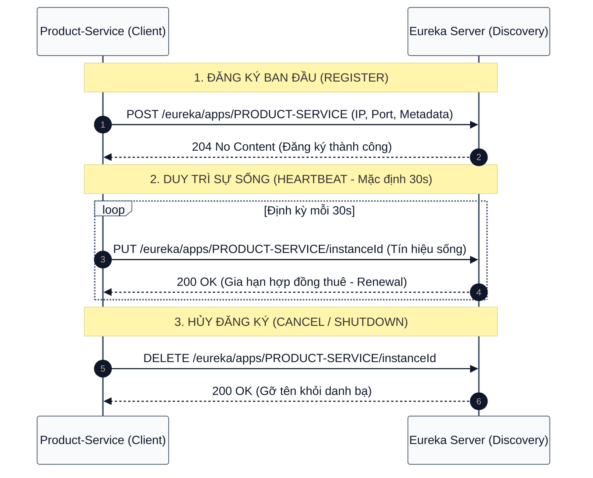

# [BÀI TẬP 1 - KHÁ] THIẾT LẬP "TRẠM ĐIỀU HƯỚNG" EUREKA SERVER

## VAI TRÒ CỦA SERVICE REGISTRY TRONG HỆ THỐNG MICROSERVICES & THỰC HÀNH CẤU HÌNH DISCOVERY SERVER ĐỘC LẬP

> **Đề bài:** Để các Service (Customer, Product, Order) không phải ghi nhớ địa chỉ IP/Port tĩnh của nhau, thiết lập một "cuốn danh bạ" trung tâm độc lập bằng Spring Boot và Spring Cloud Netflix Eureka Server.
> **Bài làm của em:** Trình bày lý thuyết cốt lõi về Service Registry & Discovery, phân tích cơ chế hoạt động của Netflix Eureka Server, hướng dẫn từng bước khởi tạo mã nguồn, cấu hình chi tiết và xác minh Dashboard tại `http://localhost:8761`.

---

## MỤC LỤC

1. [Đặt vấn đề: Nỗi đau "Hardcoded IP/Port" trong Hệ thống Phân tán](#1-đặt-vấn-đề-nỗi-đau-hardcoded-ipport-trong-hệ-thống-phân-tán)
   - 1.1. Cơn ác mộng địa chỉ tĩnh khi triển khai Cloud / Container
   - 1.2. Khái niệm Service Registry & Discovery
2. [Nguyên lý Kiến trúc Netflix Eureka Server](#2-nguyên-lý-kiến-trúc-netflix-eureka-server)
   - 2.1. Mô hình Client-Side Discovery vs. Server-Side Discovery
   - 2.2. Vòng đời đăng ký dịch vụ (Service Registration, Heartbeat Renewal, Eviction)
   - 2.3. Chế độ bảo vệ an toàn (Self-Preservation Mode)
3. [Thiết kế & Cấu trúc Thư mục Dự án discovery-server](#3-thiết-kế--cấu-trúc-thư-mục-dự-án-discovery-server)
4. [Hướng dẫn Triển khai Chi tiết](#4-hướng-dẫn-triển-khai-chi-tiết)
   - 4.1. Thiết lập `build.gradle` với Spring Boot 3 và Spring Cloud BOM
   - 4.2. Cấu hình tham số vận hành trong `application.properties`
   - 4.3. Viết mã nguồn Application với chú thích `@EnableEurekaServer`
5. [Quy trình Khởi chạy & Kiểm thử Thực tế](#5-quy-trình-khởi-chạy--kiểm-thử-thực-tế)
   - 5.1. Các bước khởi chạy dự án
   - 5.2. Quan sát và phân tích Eureka Dashboard (`http://localhost:8761`)
   - 5.3. Kiểm tra các chỉ số hệ thống qua REST API của Eureka
6. [Các lưu ý quan trọng & Lỗi thường gặp](#6-các-lưu-ý-quan-trọng--lỗi-thường-gặp)
7. [Kết luận của em](#7-kết-luận-của-em)

---

## 1. Đặt vấn đề: Nỗi đau "Hardcoded IP/Port" trong Hệ thống Phân tán

### 1.1. Cơn ác mộng địa chỉ tĩnh khi triển khai Cloud / Container

Trong kiến trúc Monolith truyền thống, mọi lời gọi hàm (method call) diễn ra trực tiếp trong cùng một tiến trình (process) và bộ nhớ RAM. Tuy nhiên, khi chuyển sang kiến trúc **Microservices**, ứng dụng được chia tách thành hàng chục hoặc hàng trăm dịch vụ nhỏ độc lập (`Customer-Service`, `Product-Service`, `Order-Service`, v.v.) chạy trên các máy chủ, máy ảo hoặc container riêng biệt.

Nếu lập trình viên cấu hình cứng địa chỉ IP và số cổng (Port) trong mã nguồn hoặc file cấu hình:

```
http://192.168.1.50:8082/api/v1/products/
```

Thì hệ thống sẽ đối mặt với các bế tắc nghiêm trọng sau:

```mermaid
%%{init: {"theme":"base","themeVariables":{"background":"#FFFFFF","primaryColor":"#F8FAFC","primaryBorderColor":"#475569","primaryTextColor":"#0F172A","secondaryColor":"#F1F5F9","tertiaryColor":"#E2E8F0","lineColor":"#475569","textColor":"#0F172A","mainBkg":"#F8FAFC","nodeBorder":"#475569","nodeTextColor":"#0F172A","titleColor":"#0F172A","clusterBkg":"#F8FAFC","clusterBorder":"#94A3B8","edgeLabelBackground":"#FFFFFF","labelTextColor":"#0F172A","fontSize":"14px"}}}%%
flowchart TD
    subgraph DONG_IP["HẠ TẦNG ĐỘNG (CONTAINER / CLOUD)"]
        direction TB
        P1["Product Service Instance A<br/>IP: 10.0.1.12 : 8082<br/><i>(Khởi động lại đổi sang 10.0.1.45)</i>"]
        P2["Product Service Instance B<br/>Auto-scale thêm vào<br/>IP: 10.0.1.99 : 8082"]
    end

    subgraph PROBLEM["VẤN ĐỀ HARDCODED"]
        O["Order Service<br/>Hardcode: 10.0.1.12"]
    end

    O -.->|Gọi thất bại (Connection Refused)| P1
    O -.->|Không hề biết tới sự tồn tại| P2
```

1. **Địa chỉ mạng thay đổi liên tục:** Trong môi trường Kubernetes, Docker Swarm hoặc Auto Scaling Group trên AWS/GCP, các container/pod liên tục được sinh ra, tự hủy, hoặc di chuyển sang worker node khác. Mỗi lần khởi động lại, IP của dịch vụ sẽ bị đổi.
2. **Khó khăn trong co giãn (Scaling):** Khi lượng truy cập tăng vọt, hệ thống cần nâng từ 1 instance lên 5 instances của `Product-Service`. Nếu không có cơ chế tập trung, `Order-Service` không thể biết được danh sách 5 địa chỉ IP mới đó để chia tải.
3. **Chi phí bảo trì cực lớn:** Mỗi lần thay đổi port hoặc chuyển môi trường (Development $\rightarrow$ Staging $\rightarrow$ Production), đội ngũ DevOps phải chỉnh sửa cấu hình thủ công ở hàng loạt dịch vụ phụ thuộc và tiến hành redeploy toàn bộ.

### 1.2. Khái niệm Service Registry & Discovery

Để giải quyết triệt để bài toán trên, kiến trúc Microservices đưa ra giải pháp **Service Registry & Discovery** (Cơ chế Đăng ký & Tự động Phát hiện Dịch vụ):

- **Service Registry (Sổ danh bạ dịch vụ):** Đóng vai trò như một cuốn "danh bạ điện thoại" trung tâm. Bất kỳ dịch vụ nào khi khởi động đều phải gửi thông tin của mình (Tên dịch vụ `Service ID`, Địa chỉ `IP`, Cổng `Port`, Trạng thái `Health Status`) lên Server này.
- **Service Discovery (Tìm kiếm danh bạ):** Khi một dịch vụ A muốn gọi dịch vụ B, thay vì tự nhớ IP của B, A chỉ cần hỏi Service Registry: _"Cho tôi danh sách các địa chỉ đang hoạt động của PRODUCT-SERVICE"_. Service Registry sẽ trả về danh sách, và dịch vụ A sẽ chọn một địa chỉ phù hợp để gửi yêu cầu.

---

## 2. Nguyên lý Kiến trúc Netflix Eureka Server

Netflix Eureka là một trong những giải pháp Service Registry & Discovery mã nguồn mở phổ biến và ổn định nhất trong hệ sinh thái Java / Spring Cloud.

### 2.1. Mô hình Client-Side Discovery vs. Server-Side Discovery

Có hai cách tiếp cận chính đối với Service Discovery:

| Tiêu chí                    | Client-Side Discovery (Netflix Eureka)                              | Server-Side Discovery (AWS ALB / Kubernetes Service)            |
| :-------------------------- | :------------------------------------------------------------------ | :-------------------------------------------------------------- |
| **Bên thực hiện phân giải** | Phía Client (Caller Service) tự truy vấn Registry và chọn đích đến. | Router/Load Balancer trung gian nhận request và phân giải IP.   |
| **Độ trễ mạng**             | Thấp hơn vì gọi trực tiếp Point-to-Point giữa các Service.          | Thêm 1 network hop qua Load Balancer trung gian.                |
| **Điểm nghẽn (Bottleneck)** | Không bị nghẽn ở tầng network trung gian.                           | Load Balancer phần cứng/mềm có thể là nút cổ chai.              |
| **Sự phụ thuộc ngôn ngữ**   | Cần tích hợp thư viện Client (Java/Spring Cloud) vào mã nguồn.      | Độc lập ngôn ngữ (Polyglot) vì Load Balancer xử lý ở tầng mạng. |

Eureka áp dụng hoàn hảo mô hình **Client-Side Discovery**: Eureka Server đóng vai trò lưu trữ cơ sở dữ liệu danh bạ, còn các Eureka Client sẽ cache danh bạ này về bộ nhớ cục bộ để thực hiện gọi trực tiếp.

### 2.2. Vòng đời đăng ký dịch vụ (Service Registration, Heartbeat, Eviction)



1. **Register (Đăng ký):** Khi Client khởi chạy, nó gửi HTTP POST chứa thông tin (IP, Port, URL kiểm tra sức khỏe) lên Eureka Server.
2. **Renew (Gia hạn / Heartbeat):** Client định kỳ gửi tín hiệu HTTP PUT "nhịp tim" (Heartbeat) sau mỗi 30 giây (mặc định) để chứng minh mình vẫn đang sống khỏe mạnh.
3. **Eviction (Thu hồi / Xóa bỏ):** Nếu quá 90 giây mà Eureka Server không nhận được heartbeat từ một instance, Server sẽ coi instance đó đã chết và xóa khỏi danh bạ thông qua một tác vụ dọn rác định kỳ (Eviction Task).
4. **Cancel (Hủy đăng ký):** Khi Client tắt một cách có kiểm soát (`SIGTERM`), nó chủ động gửi request DELETE để Eureka Server xóa nó ngay lập tức mà không cần đợi timeout 90 giây.

### 2.3. Chế độ bảo vệ an toàn (Self-Preservation Mode)

Trong môi trường phân tán, việc mất kết nối có thể do sự cố mạng tạm thời (Network Partition) giữa Client và Server, chứ bản thân Service Client không hề bị chết.

- Nếu trong một khoảng thời gian (15 phút), tỷ lệ renew heartbeat thực tế giảm xuống dưới ngưỡng an toàn (mặc định $85\%$), Eureka Server sẽ kích hoạt chế độ **Self Preservation**.
- **Hành vi khi kích hoạt:** Server dừng việc xóa (eviction) các instance quá hạn nhằm bảo vệ danh bạ, chấp nhận thông tin có thể cũ một chút nhưng tránh việc xóa nhầm toàn bộ hệ thống dịch vụ khi chỉ là đứt cáp mạng tạm thời.
- **Trong môi trường Lab/Học tập:** Do chúng ta thường bật/tắt dịch vụ liên tục trên máy cá nhân, chế độ này nên được tắt (`enable-self-preservation=false`) và giảm thời gian quét dọn rác (`eviction-interval-timer-in-ms=5000`) để quan sát giao diện cập nhật tức thì.

---

## 3. Thiết kế & Cấu trúc Thư mục Dự án discovery-server

Thư mục bài tập được tổ chức chuẩn theo mô hình Gradle đa tầng:

```
Session02/bai_1/
├── discovery-server/
│   ├── build.gradle
│   ├── settings.gradle
│   └── src/
│       └── main/
│           ├── java/
│           │   └── com/
│           │       └── rikkei/
│           │           └── discoveryserver/
│           │               └── DiscoveryServerApplication.java
│           └── resources/
│               └── application.properties
├── bai1.md
└── bai1.pdf
```

---

## 4. Hướng dẫn Triển khai Chi tiết

### 4.1. Thiết lập `build.gradle` với Spring Boot 3 và Spring Cloud BOM

Để đảm bảo tương thích tuyệt đối với JDK 17 và Spring Boot 3.3.x, khai báo `build.gradle` như sau:

```groovy
plugins {
    id 'java'
    id 'org.springframework.boot' version '3.3.4'
    id 'io.spring.dependency-management' version '1.1.6'
}

group = 'com.rikkei'
version = '0.0.1-SNAPSHOT'
description = 'Discovery Server Eureka'

java {
    toolchain {
        languageVersion = JavaLanguageVersion.of(17)
    }
}

configurations {
    compileOnly {
        extendsFrom annotationProcessor
    }
}

repositories {
    mavenCentral()
}

// Khai báo Spring Cloud Release Train (BOM)
ext {
    set('springCloudVersion', "2023.0.3")
}

dependencies {
    // Spring Boot Starter Web phục vụ HTTP endpoint & Actuator
    implementation 'org.springframework.boot:spring-boot-starter-web'

    // Thư viện lõi Eureka Server
    implementation 'org.springframework.cloud:spring-cloud-starter-netflix-eureka-server'

    // Lombok hỗ trợ viết code gọn
    compileOnly 'org.projectlombok:lombok'
    annotationProcessor 'org.projectlombok:lombok'

    testImplementation 'org.springframework.boot:spring-boot-starter-test'
}

// Quản lý phiên bản tự động bằng Bill of Materials (BOM)
dependencyManagement {
    imports {
        mavenBom "org.springframework.cloud:spring-cloud-dependencies:${springCloudVersion}"
    }
}

tasks.named('test') {
    useJUnitPlatform()
}
```

> **Giải thích kỹ thuật:**
>
> - Thư viện `spring-cloud-starter-netflix-eureka-server` đóng gói toàn bộ engine của Netflix Eureka Server và giao diện Web Dashboard dựa trên template FreeMarker.
> - Quản lý phụ thuộc thông qua `spring-cloud-dependencies` (BOM) bảo đảm tất cả các thành phần trong hệ sinh thái Spring Cloud đều đồng nhất về phiên bản, loại trừ xung đột class loader.

### 4.2. Cấu hình tham số vận hành trong `application.properties`

Cấu hình file `src/main/resources/application.properties`:

```properties
# Đặt tên định danh cho dịch vụ Eureka Server
spring.application.name=discovery-server

# Cổng mặc định tiêu chuẩn của Eureka Server là 8761
server.port=8761

# Vì bản thân là Server trung tâm, Eureka Server KHÔNG cần tự đăng ký chính mình vào danh bạ
eureka.client.register-with-eureka=false

# Eureka Server KHÔNG cần định kỳ kéo danh bạ từ đâu về (nó là nguồn dữ liệu gốc)
eureka.client.fetch-registry=false

# Tắt chế độ bảo vệ Self Preservation để phục vụ môi trường thực hành / kiểm thử
eureka.server.enable-self-preservation=false

# Chu kỳ dọn dẹp các instance không gửi heartbeat (đặt 5000ms = 5 giây)
eureka.server.eviction-interval-timer-in-ms=5000
```

> **Ý nghĩa của các thông số cấu hình:**
>
> 1. `eureka.client.register-with-eureka=false`: Mặc định, Eureka Server vẫn mang bản chất là một Spring Boot app có thư viện Eureka Client. Nếu không tắt thuộc tính này, nó sẽ cố gắng kết nối tới `http://localhost:8761/eureka/` để tự đăng ký chính mình, gây ra lỗi log đỏ `Cannot execute request on any known server` khi chưa kịp khởi động xong.
> 2. `eureka.client.fetch-registry=false`: Không cần tải bản sao danh bạ từ server khác (áp dụng cho mô hình Standalone, chỉ khi cấu hình Eureka Cluster nhiều node mới cần bật).
> 3. `eureka.server.enable-self-preservation=false`: Cho phép xóa ngay các Client bị ngắt kết nối.

### 4.3. Viết mã nguồn Application với chú thích `@EnableEurekaServer`

Tạo file `DiscoveryServerApplication.java`:

```java
package com.rikkei.discoveryserver;

import org.springframework.boot.SpringApplication;
import org.springframework.boot.autoconfigure.SpringBootApplication;
import org.springframework.cloud.netflix.eureka.server.EnableEurekaServer;

/**
 * Lớp khởi chạy ứng dụng Eureka Server.
 * Chú thích @EnableEurekaServer sẽ kích hoạt toàn bộ cấu hình tự động
 * bao gồm Eureka Server Registry, Replication logic và giao diện Dashboard tại port chỉ định.
 */
@SpringBootApplication
@EnableEurekaServer
public class DiscoveryServerApplication {

    public static void main(String[] args) {
        SpringApplication.run(DiscoveryServerApplication.class, args);
    }
}
```

---

## 5. Quy trình Khởi chạy & Kiểm thử Thực tế

### 5.1. Các bước khởi chạy dự án

Có thể khởi chạy dự án bằng một trong hai cách:

1. **Cách 1: Khởi chạy từ IntelliJ IDEA:**
   - Mở thư mục `discovery-server`.
   - Tìm đến class `DiscoveryServerApplication.java`.
   - Nhấp chuột phải chọn **Run 'DiscoveryServerApplication'**.

2. **Cách 2: Khởi chạy bằng Gradle Terminal:**
   ```bash
   cd /home/kaisento/Documents/CODE_RIKKEI/Session02/bai_1/discovery-server
   gradle bootRun
   ```

Khi bảng điều khiển console xuất hiện dòng log sau:

```
Started DiscoveryServerApplication in 2.15 seconds (process running for 2.45)
```

Ứng dụng đã sẵn sàng tiếp nhận kết nối trên cổng `8761`.

### 5.2. Quan sát và phân tích Eureka Dashboard (`http://localhost:8761`)

Mở trình duyệt và truy cập vào đường dẫn:

```
http://localhost:8761
```

Giao diện Web Dashboard của Eureka sẽ hiển thị các khu vực quan trọng:

1. **System Status (Trạng thái hệ thống):**
   - **Environment:** test / production
   - **Current time:** Thời gian máy chủ hiện tại
   - **Uptime:** Thời gian dịch vụ đã hoạt động liên tục
   - **Renews threshold:** Ngưỡng heartbeat tối thiểu
   - **Renews (last min):** Số heartbeat nhận được trong 1 phút vừa qua
2. **DS Replicas:**
   - Danh sách các node Eureka dự phòng (ở chế độ Standalone sẽ trống).
3. **Instances currently registered with Eureka (Bảng danh bạ dịch vụ):**
   - Khi chưa có Client nào kết nối, bảng sẽ hiển thị thông báo:
     ```
     No instances available
     ```
   - Đây là trạng thái hoàn toàn chính xác của một Eureka Server mới khởi tạo thành công độc lập.
4. **Cảnh báo Self-Preservation:**
   - Do cấu hình `enable-self-preservation=false`, trên đầu trang sẽ có thông báo màu đỏ cảnh báo:
     > _"THE SELF PRESERVATION MODE IS TURNED OFF. THIS MAY NOT BE PROTECTIVE IN CASE OF NETWORK/OTHER PROBLEMS."_
     > (Chế độ tự bảo vệ đã tắt - đây là điều chúng ta chủ động thiết lập cho môi trường lab để theo dõi sự biến động của client tức thì).

### 5.3. Kiểm tra các chỉ số hệ thống qua REST API của Eureka

Ngoài giao diện trực quan, Eureka Server cung cấp đầy đủ API chuẩn XML/JSON để các công cụ tự động truy vấn:

```bash
# Truy vấn toàn bộ ứng dụng đang đăng ký (dạng JSON)
curl -H "Accept: application/json" http://localhost:8761/eureka/apps
```

Kết quả phản hồi JSON chuẩn:

```json
{
  "applications": {
    "versions__delta": "1",
    "apps__hashcode": "",
    "application": []
  }
}
```

---

## 6. Các lưu ý quan trọng & Lỗi thường gặp

1. **Lỗi `ConnectException: Connection refused` lúc khởi động:**
   - **Nguyên nhân:** Quên không đặt `register-with-eureka=false` và `fetch-registry=false`, dẫn đến việc Eureka Server tự tìm kiếm một Eureka Server khác tại port 8761 khi chính nó chưa bind xong port.
2. **Lỗi xung đột cổng 8761:**
   - Nếu cổng 8761 đang bị chiếm dụng bởi tiến trình khác, có thể kiểm tra và tắt bằng:
     ```bash
     lsof -i :8761
     kill -9 <PID>
     ```
3. **Phiên bản Java & Spring Boot:**
   - Spring Boot 3.x bắt buộc chạy trên Java 17 trở lên. Sử dụng Java 8 hoặc 11 sẽ gây ra lỗi `UnsupportedClassVersionError: 61.0`.

---

## 7. Kết luận của em

Qua Bài tập 1, em đã:

- Nắm vững vai trò huyết mạch của **Service Registry & Discovery** trong việc giải quyết bài toán định vị động trong hệ thống phân tán.
- Hiểu rõ cơ chế heartbeat, gia hạn hợp đồng thuê (lease renewal) và dọn rác (eviction) của Netflix Eureka.
- Thiết lập thành công trạm điều hướng trung tâm `discovery-server` chạy độc lập trên cổng chuẩn `8761`, sẵn sàng cho bước tiếp theo là đăng ký các Eureka Client (`Customer`, `Product`, `Order`) vào hệ thống danh bạ.
